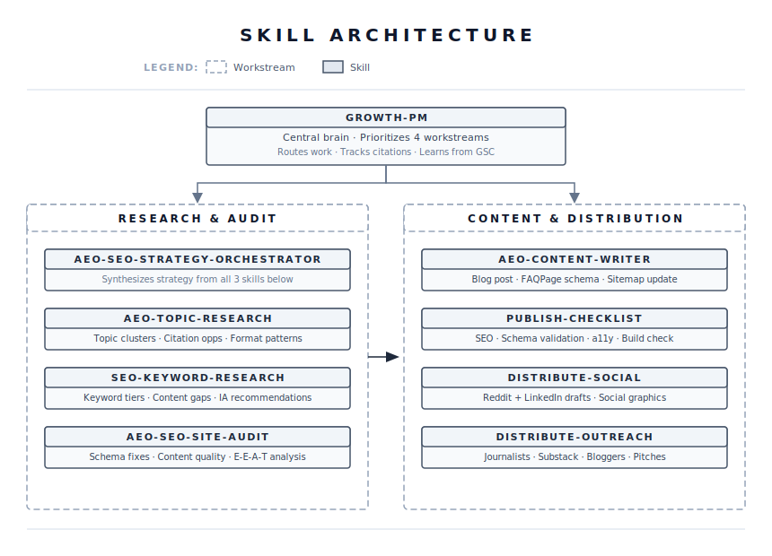

# claude-skills

SEO, AEO, and content distribution skills for Claude — a tested workflow for researching, writing, and distributing content that gets cited by AI answer engines and ranks in search.

**Two skill groups:**
- **Research & Audit** — understand what AI engines are citing, find keyword gaps, audit existing pages
- **Content & Distribution** — write AEO-optimized content, distribute it via Reddit/LinkedIn/etc, track citations

Designed to complement Ahrefs/Semrush by:
- Understanding your site's content, intent, and target audience
- Recommending UX and IA changes
- Reporting on how real people phrase questions in your niche (Reddit language glossary)
- Validating schema against your pages' content type

## Multi-agent architecture



Research & Audit skills use a **Coordinator → Haiku → Sonnet** pipeline to balance speed, cost, and quality:

- **Coordinator** (main Claude): gathers input, orchestrates agents
- **Haiku agents**: parallel mechanical extraction — API calls, page crawls, data collection
- **Sonnet agent**: analysis, synthesis, and report writing

The output reports include a **Token Usage Summary** with per-agent input/output tokens and estimated cost. The orchestrator aggregates token costs across all three skills into a single grand total.

## Configuration

Each skill has a `CONFIG.example.md`. Change it to `CONFIG.md` in the same folder and fill in your values (site URL, tracker paths, etc.). `CONFIG.md` is gitignored — your project-specific values stay local.

---

## Table of Contents

**Research & Audit**
- [Setup](#setup)
- [Quick Start](#quick-start)
- [0. aeo-seo-strategy-orchestrator](#0-aeo-seo-strategy-orchestrator--complete-seaaeo-strategy--roadmap-orchestrator)
- [1. aeo-topic-research](#1-aeo-topic-research--aeo-topic-research--opportunities)
- [2. seo-keyword-research](#2-seo-keyword-research--competitor-analysis--keyword-research)
- [3. aeo-seo-site-audit](#3-aeo-seo-site-audit--site-audit--aeo-optimization)

**Content & Distribution**
- [4. growth-pm](#4-growth-pm--growth-coordinator)
- [5. aeo-content-writer](#5-aeo-content-writer--blog-post-writer)
- [6. aeo-distribution](#6-aeo-distribution--post-publication-distribution)
- [7. publish-checklist](#7-publish-checklist--pre-publish-validation)
- [8. reddit-content](#8-reddit-content--reddit-draft-generator)
- [9. linkedin-launch](#9-linkedin-launch--linkedin-post-writer)

---

## Setup

### 1. Recommend using locally

The `aeo-seo-site-audit` skill uses `curl` to analyze schema markup, but Claude Web doesn't have permission to run `curl`, so you'll be prompted to check schema manually using [Google's Rich Results Test](https://search.google.com/test/rich-results).

Additionally, running the audit skill locally allows your AI coding agent to run a continuous improvement loop (`audit -> fix -> audit -> fix`) without needing to deploy each fix.

### 2. Connect Ahrefs MCP (optional)

- A paid Ahrefs account gives you access to real keyword data such as search volumes, difficulty scores, and competitor traffic, and AI engine visibility.
- Otherwise, skills use web-scraped estimates instead of actual data.

---

## Quick Start

### Want the research and audit results in 1 report?
Use **`aeo-seo-strategy-orchestrator`** for a unified audit that runs all three core skills in parallel and synthesizes recommendations into one list.

Or, run each skill separately. 
```
* aeo-topic-research      →  Recommends topics, content format, and UX changes for AEO
* seo-keyword-research    →  Find competitive keywords, content gaps, and IA recommendations for SEO
* aeo-seo-site-audit      →  Audit & optimize your pages for SEO and AEO
```

---

## 0. `aeo-seo-strategy-orchestrator` — Complete SEO/AEO Strategy & Roadmap (Orchestrator)

**File:** `aeo-seo-strategy-orchestrator/SKILL.md`

### Goal
An all-in-one strategy. This orchestrates all three core skills (`aeo-topic-research`, `seo-keyword-research`, `aeo-seo-site-audit`) in parallel, then a Sonnet synthesis agent unifies all findings into a single ranked strategy.

### Agent Architecture
- **Coordinator**: gathers input, launches three sub-skill agents simultaneously
- **Sub-skill agents** (parallel): each runs its own full Haiku + Sonnet pipeline
- **Sonnet Synthesis Agent**: merges all three reports, deduplicates, ranks recommendations, aggregates token costs

### Input
- Your domain (i.e. your homepage URL)
- [Optional] 2–5 competitor URLs
- [Optional] Target website URLs to audit (5–10 core pages)
- [Optional] Ahrefs account for real keyword data
- [Optional] Market/niche and business goals
- [Optional] Current site pain points or goals

### What it synthesizes
- **Topic research** — what AI engines are answering, what's being cited
- **Competitive analysis** — keyword gaps, ranking opportunities, quick wins
- **Site audit** — technical SEO, content quality, current AEO level
- **Functionality analysis** — site architecture, feature gaps, UX friction points
- **Unified strategy** — integrated list of prioritized recommendations

### Output
A strategic report with:
- Executive summary with Top 3 Opportunities (colored priority badges)
- Unified prioritized recommendations: summary table (one row per item, colored badge) followed by detailed items; **all** 🔴 Critical and 🟡 Important issues always included; top 2 🟢 Enhancements per skill shown, with a note if more were omitted
- Detailed findings grouped by category (AEO research, keywords, on-page, functionality)
- Aggregated Token Usage Summary with grand total cost across all agents

---

## 1. `aeo-topic-research` — AEO Topic Research & Opportunities

**File:** `aeo-topic-research/SKILL.md`

### Goal
Discovers what questions AI engines are answering in your niche, which domains and pages they're citing, and what content formats are winning citations — so you know exactly what topics to create for AEO visibility.

### Agent Architecture
- **Coordinator**: gathers input, orchestrates two waves of Haiku agents
- **Haiku Brand Radar Agents** (parallel, one per AI engine): Steps 3–5 — Brand Radar API calls for AI questions, cited domains, cited pages
- **Haiku Reddit Agent**: Step 6 — web searches + thread fetches per topic cluster
- **Haiku Page Crawl Agents** (parallel, one per URL): Step 7 — extract content format and structure signals; sampling ensures **at least 2 pages per content format type** (guide, listicle, comparison, FAQ/definition, HowTo, stat roundup) for reliable pattern detection
- **Sonnet Agent**: Steps 8–11 — synthesize patterns, score opportunities, generate report

### Input
- Your brand name and website URL
- Your market/niche (e.g. "email marketing software")
- [Optional] 2–5 competitor brand names to compare against
- [Optional] Which AI engines to prioritize (ChatGPT, Perplexity, Google AI Overviews, Gemini)
- [Optional] Ahrefs account for real Brand Radar citation data

### What it discovers
- **AI-answered questions** — what are people asking that AI search engines are answering?
- **Reddit language** — how real people phrase questions and describe problems in your niche, surfacing vocabulary and unmet needs that formal research misses
- **Cited domains & pages** — who is AI citing most often, and which specific pages win citations?
- **Content patterns** — what topics, formats, and structures get cited by AI engines?
- **Content gaps** — opportunities where you can create content that AI engines will cite
- **Content presentation & UX** — navigation aids (TOC, jump links, sticky nav), multimedia gaps, and formatting patterns from citation-winning pages

### Output
A prioritized content opportunity brief including: a summary table of all recommendations (one row per item, colored priority badge) followed by detailed items with content briefs; topic clusters ranked by citation potential; a Reddit language glossary; competitor citation analysis; winning content formats; content presentation recommendations; and a Token Usage Summary.

---

## 2. `seo-keyword-research` — Competitor Analysis & Keyword Research

**File:** `seo-keyword-research/SKILL.md`

### Goal
Analyzes competitor websites to reverse-engineer their SEO strategies, identifies content gaps and keyword opportunities, and produces a prioritized list of target keywords with ranking and traffic potential.

### Agent Architecture
- **Coordinator**: gathers input, orchestrates two waves of Haiku agents
- **Haiku Competitor Agents** (parallel, one per competitor): Steps 3–4 — Ahrefs metrics + top keywords (Step 3), crawl key pages (Step 4); each competitor gets **exactly 2 pages per type** (homepage, blog/resource, category/topic hub, product/service detail) for consistent cross-run comparisons
- **Haiku Keyword Research Agent**: Step 5 — Ahrefs keyword explorer calls using seeds from competitor data
- **Sonnet Agent**: Steps 6–11 — content analysis, gap analysis, ranking evaluation, prioritization, IA recommendations, report

### Input
- Your domain (i.e. your homepage URL)
- [Optional] 2–5 competitor domains
- [Optional] Connect your Ahrefs account for real data

### What it analyzes
- **Competitor content strategy** — what topics do they cover, and how?
- **Content gaps** — keywords they rank for that you don't (and vice versa)
- **Keyword opportunities** — ranked by ranking potential, search volume, and competitive difficulty
- **Traffic analysis** — estimated traffic potential and ROI for target keywords
- **Information architecture** — navigation structure, topic cluster hub pages, internal linking, and content silos based on keyword clustering

### Ahrefs integration
When the **Ahrefs MCP server** is connected, you get real data:
- Exact search volumes and traffic figures
- Ahrefs keyword difficulty scores (0–100)
- Actual competitor organic traffic
- SERP feature data and adjustments

### Output
A competitive keyword strategy with: a summary table of all recommendations (one row per item, colored priority badge) followed by detailed items; keyword tiers (Quick Wins / Strategic / Long-term) with traffic estimates; content gap analysis; information architecture recommendations (navigation changes, hub pages, internal linking, content silos); and a Token Usage Summary.

---

## 3. `aeo-seo-site-audit` — Site Audit & AEO Optimization

**File:** `aeo-seo-site-audit/SKILL.md`

### Goal
Analyzes your website pages for content quality, schema markup completeness, and AEO (Answer Engine Optimization) — with actionable recommendations for improving AI citation potential and search ranking for your existing pages. **Complements an Ahrefs Site Audit** by covering content depth and AI-readiness that Ahrefs cannot assess; relies on Ahrefs for technical SEO (title tags, meta descriptions, broken links, crawlability, etc.).

### Agent Architecture
- **Coordinator**: gathers input, launches one Haiku agent per URL (+ one Ahrefs agent if project ID provided) in parallel
- **Haiku URL Agents** (parallel, one per URL): fetch raw HTML, extract JSON-LD schema, extract content and authority signals; after user-specified URLs, **required representative sampling** adds 1–2 pages per type not yet covered (static content, dynamic/app route, category/listing, utility) to prevent missing CSR rendering gaps
- **Haiku Ahrefs Agent** (if project ID provided): pulls technical audit findings from Ahrefs API
- **Sonnet Agent**: schema validation, content analysis, gap prioritization, report writing

### Input
- 1 or more target URLs from your website
- [Optional] Ahrefs Site Audit project ID — automatically pulls technical audit findings to combine with content analysis
- [Optional] Business context and content goals (e.g. targeting AI search engines)

### What it analyzes
- **Schema markup** — validates JSON-LD completeness and accuracy (FAQPage, HowTo, Article, Organization, etc.), flags missing or mismatched schema
- **Content quality** — depth, directness, E-E-A-T signals, readability, topical coherence
- **AEO optimization** — direct-answer formatting, author credentials, source citations, freshness signals, content structure for AI extraction

### Output
A prioritized audit report with: a summary table of all recommendations (one row per item, colored priority badge) followed by detailed items; findings grouped by severity (🔴 Critical / 🟡 Important / 🟢 Enhancement); specific schema fixes with effort estimates; a page-by-page breakdown; and a Token Usage Summary. If an Ahrefs project ID is provided, the report integrates Ahrefs technical findings alongside the content/AEO analysis.

---

## 4. `growth-pm` — Growth Coordinator

**File:** `growth-pm/SKILL.md`

### Goal
Central coordinator for the content pipeline. Reads a master tracker (Google Sheet or equivalent), analyzes a feedback log, and routes work to the right downstream skill with an optimized prompt.

### When to use
- "What should we work on next?"
- "Run the daily growth routine"
- "Check the tracker and prioritize"

### Input
- Access to your tracker (URL in `CONFIG.md`)
- [Optional] Recent feedback or experiment results

### Output
A structured handoff: current priority, feedback applied, and an exact prompt for the target skill.

---

## 5. `aeo-content-writer` — Blog Post Writer

**File:** `aeo-content-writer/SKILL.md`

### Goal
Writes AEO-optimized blog posts using BLS, O*NET, or equivalent authoritative data. Output includes the post component, route file, blog index entry, thumbnail, and sitemap update — ready to ship.

### Content structure
Lead with finding → show evidence → explain meaning → caveats → actionable takeaway. Every post includes 4 FAQ pairs that drive `FAQPage` JSON-LD schema for AI citation signals.

### Input
- Post topic and target persona
- Data sources (BLS/O*NET or custom)
- Tone guide path (set in `CONFIG.md`)

### Output
All files needed to publish: post component, route page, blog index entry, sitemap block.

---

## 6. `aeo-distribution` — Post-Publication Distribution

**File:** `aeo-distribution/SKILL.md`
**Config:** `CONFIG.example.md` → copy to `CONFIG.md`

### Goal
Maximizes the chance AI engines discover and cite a newly published post. Runs after publish-checklist passes.

### Workflow (sequential → parallel)
1. **Google Search Console** — submit URL for indexing
2. **Reddit** — invokes `reddit-content` skill, saves drafts to `{REDDIT_OUTPUT_PATH}`
3. **LinkedIn** — invokes `linkedin-launch` skill
4. **Backlink outreach** — finds Substack writers, journalists, bloggers; generates personalized pitches
5. **Citation tracking** — sets up Day 0 / Day 7 / Day 14 monitoring across ChatGPT, Perplexity, Google AI Overviews, Gemini

### Input
- Post slug, title, URL, key claim, target persona

### Output
Ready-to-use drafts + a tracker checklist with scheduled follow-up dates.

---

## 7. `publish-checklist` — Pre-Publish Validation

**File:** `publish-checklist/SKILL.md`
**Config:** `CONFIG.example.md` → copy to `CONFIG.md`

### Goal
Validates any page before it goes live — SEO metadata, schema markup, accessibility, internal links, and a build check. Runs an automated validation script then does page-type-specific checks.

### When to use
- Before publishing or updating any blog post, career page, industry page, or /now article
- Invoked automatically by `aeo-distribution` after publish

### What it checks
- **Phase 0** — runs your automated validation script, fixes all FAILs
- **Phase 1 (shared)** — anchor links, image paths, title/description length, OG tags, JSON-LD schema type, AEO formatting, accessibility (aria-expanded, aria-hidden), mobile layout
- **Phase 2 (page-type-specific)** — rules defined in your `site-checklist.md` for each page type (blog, career, industry, /now)

### Output
PASS / FAIL / FIXED report per check.

---

## 8. `reddit-content` — Reddit Draft Generator

**File:** `reddit-content/SKILL.md`
**Config:** `CONFIG.example.md` → copy to `CONFIG.md`

### Goal
Finds live Reddit threads where a new post is directly relevant, then writes ready-to-paste comment drafts. No Reddit API — output is a `.md` file the user pastes manually.

### How it works
Web-searches target subreddits for threads ≤48h old. Matches thread type (career-risk, career-change, no-degree, comparative, etc.) to a comment angle. Drafts ≤250-word comments that open with a direct answer, include one specific data point, and place the link at the end. Falls back to a standalone post draft if no live threads found.

### Input
- Post URL, title, key claim
- [Optional] Custom subreddit list (defaults in `CONFIG.example.md`)

### Output
`{REDDIT_OUTPUT_PATH}reddit_drafts_[slug]_[date].md`

---

## 9. `linkedin-launch` — LinkedIn Post Writer

**File:** `linkedin-launch/SKILL.md`
**Config:** `CONFIG.example.md` → copy to `CONFIG.md`

### Goal
Writes LinkedIn posts that announce launches, new content, or data findings. Optimizes for genuine reach — not engagement bait.

### Format rules
- Opening earns the fold-expand with a specific fact, not a teaser
- Link near the end, after the post earns it
- Image required (every post)
- ≤3 hashtags; no hashtag wall
- No AI-writing anti-patterns: no rhetorical repetition, no em-dash pivots, no "that told us something"

### Input
- Post title, key claim, target persona, best data point, post URL

### Output
One ready-to-post LinkedIn draft (short or long form) with graphic suggestions.

---
