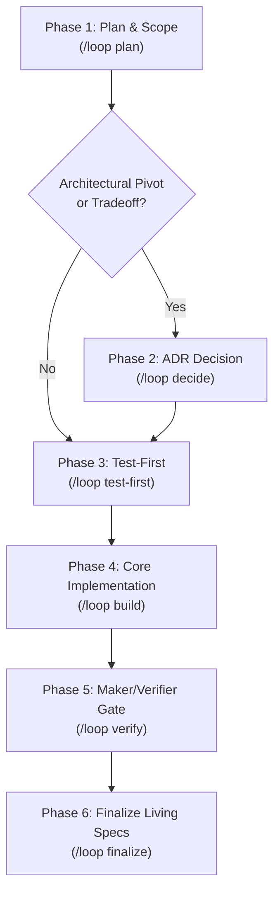

# loop-engineering

An end-to-end engineering operating system for building maintainable, high-integrity software. It transforms ad-hoc coding into a repeatable, spec-and-test-driven development loop.

---

## Core Tenets & System Invariants

1. **Spec-and-Test-Driven**: The order of operations is immutable:
   $$	ext{Living Spec / Unit Scope} \longrightarrow 	ext{Test Matrix } (T_1..T_n) \longrightarrow 	ext{Implementation} \longrightarrow 	ext{Verification}$$
2. **Documentation Taxonomy & Lifecycle**:
   - **Living Specs (`specs/*.md`, `DESIGN.md`)**: The source of truth for what the system does *today*. Never use strikethroughs or describe decommissioned architecture in living specs.
   - **Decision Records (`decisions/NNN-*.md`)**: Immutable ADRs capturing *why* choices, pivots, and cuts occurred. Once accepted, they are never edited; future changes supersede them via a new ADR.
   - **Historical Build Units (`history/units/NN-*.md`)**: Completed milestone contracts with frozen acceptance criteria and mapped test cases.
3. **Maker / Verifier Separation**:
   - The session/agent that writes the code **must not self-approve** its work.
   - An independent verification pass (or subagent) audits the mechanical facts + test fidelity + semantic acceptance criteria.
4. **Architectural Seams & Determinism**:
   - Deterministic logic stays out of LLMs. Pure domain logic lives in tested library core packages (`recipe_core/`, domain models, etc.).
   - Route handlers and CLI tools are thin adapters.
   - Multi-tenant and security scoping is enforced at the database/store seam (e.g. `RecipeStore.for_user(user)`), making unscoped data leaks structurally impossible.
5. **Product Lens First**:
   - Lead with user outcomes. Frame decisions as tradeoffs the user can feel (gains vs losses), not raw engineering mechanisms (`normalize vs additive table`).
6. **Safe Git Hygiene**:
   - Never auto-commit without explicit, unambiguous user instruction for that specific unit.
   - Leave diffs staged/uncommitted for human inspection.

---

## The 6-Phase Engineering Loop



---

### Phase 1: Plan & Scope (`/loop plan [feature/unit]`)

**Goal**: Scope the change into a discrete, bounded build unit with explicit test scenarios before writing code.

1. **Product Framing**:
   - What does the user see, do, or gain? What does NOT change?
   - Identify all user-facing edge cases and error states.
2. **Define Unit Contract**:
   - Create/draft unit spec using `templates/UNIT_TEMPLATE.md`.
   - Assign unit number (e.g. `history/units/NN-<name>.md` or `specs/<subsystem>.md`).
   - Define exact seams, boundaries, schema migrations, and scoping guarantees.
3. **Formulate Test Matrix ($T_1..T_n$)**:
   - Enumerate explicit, bold test IDs:
     - `- **T1 [Happy Path]** — ...`
     - `- **T2 [Edge Case / Malformed Input]** — ...`
     - `- **T3 [Data Invariant / Security Boundary]** — ...`
4. **Define Semantic Acceptance Criteria**:
   - Bulleted list of inspectable outcomes and behaviors required for sign-off.

---

### Phase 2: Architectural Decision Gate (`/loop decide [title]`)

**Goal**: Capture non-obvious architecture choices, schema shifts, or cuts in an immutable ADR before implementation drifts.

1. **Trigger Condition**:
   - Schema modifications, tenant scoping changes, model/API provider switches, cuts of planned features, or structural refactors.
2. **Draft the ADR**:
   - Use `templates/ADR_TEMPLATE.md` under `decisions/NNN-<slug>.md`.
   - Capture **Context & Problem Statement** (both user friction and engineering friction).
   - State the **Decision** and why alternatives were rejected.
   - Highlight **Consequences & User Tradeoffs** in user-outcome terms.

---

### Phase 3: Test-First Scaffolding (`/loop test-first [unit]`)

**Goal**: Write deterministic tests that map 1:1 to the $T_1..T_n$ matrix before touching domain logic.

1. **Create or Update Subsystem Tests**:
   - Place in `tests/<subsystem>/test_NN_*.py` or `tests/test_NN_*.py`.
   - Name test functions with matching test tokens (e.g. `test_t1_happy_path()`, `test_t2_corrupted_image()`).
2. **Injectable I/O**:
   - Ensure external network, clock, and vision models are mockable/injectable.
   - Tests run fast, offline, and deterministically.
3. **Verify Red State**:
   - Confirm tests fail as expected for the right reasons before implementation begins.

---

### Phase 4: Core & Seam Implementation (`/loop build [unit]`)

**Goal**: Implement minimal, high-integrity code satisfying the specs and passing all tests.

1. **Domain Logic in Core First**:
   - Implement business logic, validations, and database access inside the core package (`recipe_core/`).
   - Keep deterministic logic out of prompts/LLMs.
   - Flag recoverable issues (`needs_review`); never silently discard data.
2. **Thin Web/UI/CLI Layer Second**:
   - Wire route handlers, templates, and CLI entry points.
   - Maintain strict tenant scoping in the store/data access layer.
3. **Internal Verification**:
   - Run tests: `uv run pytest` (or configured test runner).
   - Format and lint: `uv run ruff check .` and `uv run ruff format .`.

---

### Phase 5: Independent Maker/Verifier Gate (`/loop verify [unit]`)

**Goal**: Execute an independent, multi-tiered audit of the implementation against the acceptance criteria.

> [!IMPORTANT]
> **Independence Invariant**: The maker does not sign off on its own work. A separate subagent or fresh verification pass audits the code against the spec without maker rationalization.

1. **Mechanical CI Gate (Deterministic)**:
   Run the bundled runner:
   ```bash
   python scripts/check_loop.py NN
   ```
   Inspect emitted JSON facts:
   - Pytest exit code & summary.
   - Ruff lint & format exit codes.
   - Mapping of $T_1..T_n$ test IDs (no missing test IDs permitted).
   - Seam importability and static invariants.
2. **Test Fidelity Audit (Judgment)**:
   - Verify that test assertions are substantive, not tautological or hollow.
   - Check that error branches explicitly assert reasons and status flags.
3. **Semantic Acceptance Criteria Audit (Judgment)**:
   - Evaluate every bullet in the unit's acceptance criteria against code and observed behavior.
4. **Verdict Table**:
   Emit a structured verdict:
   ```markdown
   ### Unit NN — <Unit Name> Verification Verdict
   | Criterion / Gate | Status | Evidence |
   | :--- | :--- | :--- |
   | Test Mapping (T1..Tn) | PASS | n/n mapped and asserting correctly |
   | Pytest & Ruff Gates | PASS | All unit tests green; 0 lint errors |
   | Seam & Architecture Invariants | PASS | Logic isolated in core; scoping verified |
   | Semantic Acceptance Criteria | PASS | <Evidence for each criterion> |
   | **OVERALL VERDICT** | **PASS** | **Ready for living spec sync** |
   ```

---

### Phase 6: Living Spec Sync & Clean Handoff (`/loop finalize [unit]`)

**Goal**: Synchronize living documentation with production reality and leave clean diffs for human review.

1. **Update Living Specs**:
   - Update `specs/<subsystem>.md` and `DESIGN.md` to reflect current behavior.
   - Remove obsolete architectural descriptions (no strikethroughs).
2. **Update Milestone Trackers**:
   - Check the milestone box in `SPEC.md` or high-level tracker once OVERALL verdict is `PASS`.
   - Move or archive the build unit in `history/units/` if applicable.
3. **Clean Review State**:
   - Provide the user with a concise summary of user impact, key files changed, and test results.
   - Leave changes uncommitted for user review. Never auto-commit.

---

## Quick Reference Commands

| Command | Action | Output / Gate |
| :--- | :--- | :--- |
| `/loop plan <name>` | Scope a new unit with $T_1..T_n$ | Unit markdown from `UNIT_TEMPLATE.md` |
| `/loop decide <title>` | Record architectural pivot / ADR | Immutable record in `decisions/NNN-*.md` |
| `/loop test-first <unit>` | Scaffold subsystem tests | Green/Red test scaffolding mapping $T_1..T_n$ |
| `/loop build <unit>` | Implement core & seam logic | Passing code + zero lint issues |
| `/loop verify <unit>` | Independent maker/verifier audit | Full PASS/FAIL criteria verdict table |
| `/loop finalize <unit>` | Sync living specs & handoff | Updated `specs/`, `DESIGN.md`, staged diff |
